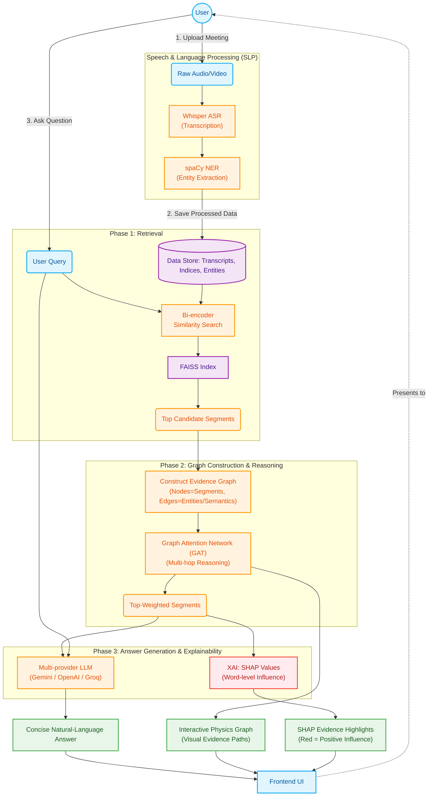

# LISTEN System Design and Workflow

This document provides a visual overview of the **LISTEN (Layered Interpretable Spoken Transcript Evidence Network)** architecture, outlining how data flows from user input through processing, reasoning, and final answer generation with explainability.

### Flow Breakdown:
1. **Speech & Language Processing (SLP):** The system first transcribes raw media uploads using Whisper and extracts named entities using spaCy. This processed text data is indexed and stored.
2. **Phase 1 (Retrieval):** When a user submits a query, a bi-encoder similarity search alongside FAISS quickly retrieves the most relevant segments from the transcript.
3. **Phase 2 (Graph Construction & GAT Reasoning):** The candidate segments are assembled into a graph (nodes are segments, edges are shared entities/semantic meaning). A trained Graph Attention Network (GAT) traverses this graph to perform multi-hop reasoning, ultimately assigning weights to segments based on their relevance.
4. **Phase 3 (Answer Generation):** The highest-weighted segments are passed as context to an LLM to generate a natural language response to the user's question.
5. **Explainable AI (XAI):** Simultaneously, SHAP values are computed on the selected evidence, scoring exactly which words positively influenced the model's retrieval (highlighted in red on the frontend).
6. **Frontend Delivery:** The final outputs—the LLM Answer, the Interactive Evidence Graph, and the SHAP highlights—are all presented to the user via the frontend UI.
